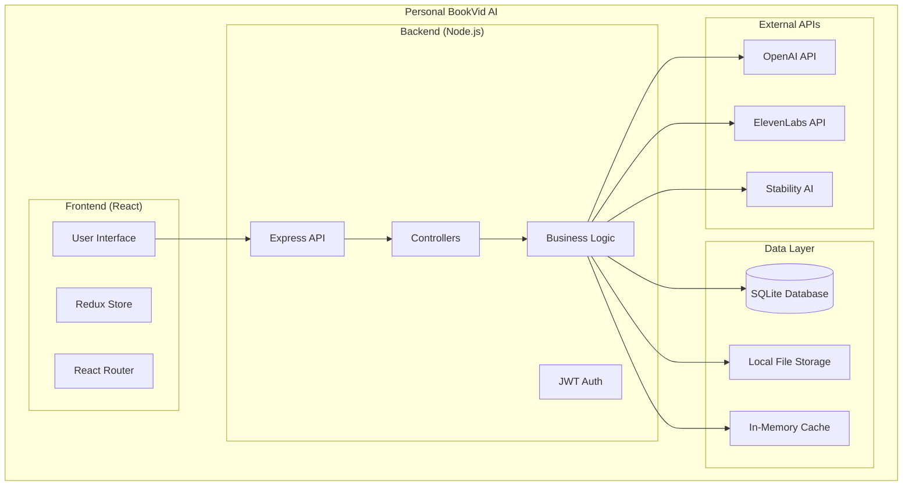
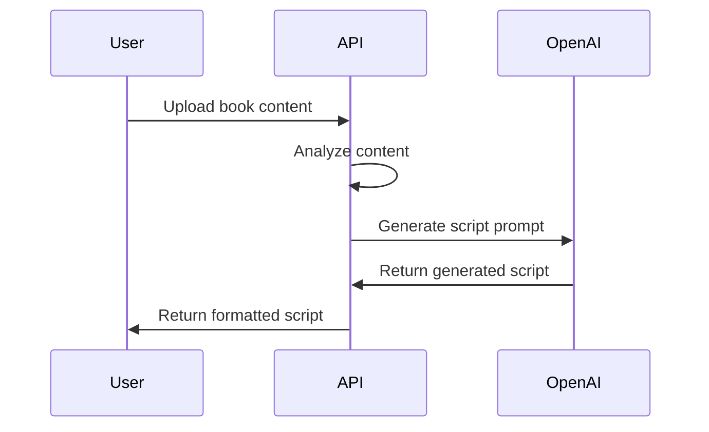
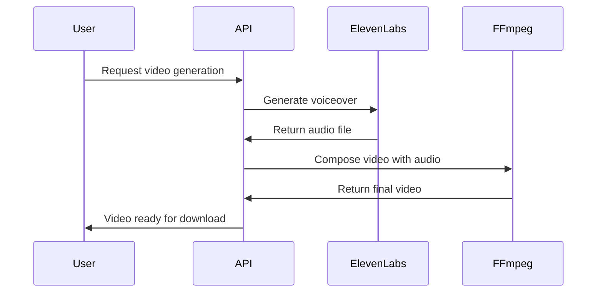

# BookVid AI Personal Project Architecture

## Overview

This document describes the architecture of the **personal version** of BookVid AI, which has been simplified and transformed from the original commercial SaaS platform for individual use, portfolio demonstration, and learning purposes.

## Architecture Transformation

### From Commercial SaaS to Personal Project

The personal version represents a significant architectural simplification:

#### Removed Commercial Components

| Component | Commercial Version | Personal Version | Reason |
|-----------|-------------------|------------------|---------|
| **Database** | PostgreSQL + Redis | SQLite only | Simplified deployment, no separate DB server |
| **Payment** | Stripe integration | Removed | No subscriptions needed |
| **Authentication** | Auth0/Cognito | Simple JWT | Reduced complexity |
| **Storage** | AWS S3 | Local filesystem | No cloud dependencies |
| **Caching** | Redis cluster | In-memory | Simplified infrastructure |
| **User Management** | Complex roles/tiers | Basic users | No subscription tiers |
| **Microservices** | Separate AI services | Integrated APIs | Simplified deployment |

#### Architectural Benefits

- **Single Container**: Everything runs in one Docker container
- **No External Dependencies**: Only requires API keys for AI services
- **Local Development**: Easy to run locally without cloud setup
- **Cost Effective**: No infrastructure costs, only API usage
- **Portfolio Ready**: Self-contained demonstration

## Current Architecture

### High-Level Architecture



### Technology Stack

#### Frontend Stack
- **React 18**: Modern React with hooks and context
- **Vite**: Fast build tool and dev server
- **TailwindCSS**: Utility-first CSS framework
- **Redux Toolkit**: State management
- **React Router**: Client-side routing
- **React Hook Form**: Form handling with validation

#### Backend Stack
- **Node.js 18+**: JavaScript runtime
- **Express.js**: Web framework
- **SQLite**: Lightweight, file-based database
- **JWT**: JSON Web Tokens for authentication
- **Multer**: File upload handling
- **In-Memory Cache**: Simple caching without Redis

#### AI Integration
- **OpenAI API**: GPT models for script generation
- **ElevenLabs API**: Text-to-speech synthesis
- **Stability AI**: Image generation (optional)
- **FFmpeg**: Video processing and rendering

## Detailed Component Architecture

### Frontend Architecture

```
client/
├── src/
│   ├── components/          # Reusable UI components
│   │   ├── auth/           # Authentication components
│   │   ├── demo/           # Demo mode components
│   │   └── common/         # Shared components
│   ├── pages/              # Route-level components
│   │   ├── LandingPage.jsx
│   │   ├── DashboardPage.jsx
│   │   └── LoginPage.jsx
│   ├── services/           # API communication
│   │   ├── authService.js
│   │   └── demoService.js
│   ├── store/              # Redux store
│   │   ├── index.js
│   │   └── slices/
│   └── utils/              # Helper functions
```

**Key Features:**
- **Demo Mode**: Portfolio-ready demonstration capabilities
- **Simplified Auth**: No external auth providers
- **Responsive Design**: Mobile-first with TailwindCSS
- **State Management**: Redux for global state

### Backend Architecture

```
server/
├── controllers/            # Route handlers
│   ├── auth.js            # Authentication endpoints
│   └── example.js         # Demo endpoints
├── models/                # Database models
│   ├── User.js            # User model
│   ├── Book.js            # Book model
│   ├── Video.js           # Video model
│   └── BaseRepository.js  # Base repository pattern
├── services/              # Business logic
│   ├── scriptGeneration.js
│   ├── voiceSynthesis.js
│   ├── videoRenderer.js
│   └── cacheService.js
├── middleware/            # Express middleware
│   ├── auth.js            # JWT authentication
│   └── fileUpload.js      # File upload handling
└── utils/                 # Helper utilities
    ├── database.js        # SQLite utilities
    └── fileStorage.js     # Local file management
```

**Key Features:**
- **Repository Pattern**: Clean data access layer
- **Service Layer**: Business logic separation
- **Middleware**: Authentication and file handling
- **Error Handling**: Comprehensive error management

### Database Schema (SQLite)

```sql
-- Users table (simplified)
CREATE TABLE users (
  id TEXT PRIMARY KEY,
  username TEXT UNIQUE NOT NULL,
  email TEXT UNIQUE NOT NULL,
  password_hash TEXT NOT NULL,
  created_at DATETIME DEFAULT CURRENT_TIMESTAMP
);

-- Books table
CREATE TABLE books (
  id TEXT PRIMARY KEY,
  user_id TEXT NOT NULL,
  title TEXT NOT NULL,
  author TEXT NOT NULL,
  genre TEXT,
  description TEXT,
  cover_image_path TEXT,
  content TEXT,
  created_at DATETIME DEFAULT CURRENT_TIMESTAMP,
  updated_at DATETIME DEFAULT CURRENT_TIMESTAMP,
  FOREIGN KEY (user_id) REFERENCES users(id)
);

-- Videos table
CREATE TABLE videos (
  id TEXT PRIMARY KEY,
  user_id TEXT NOT NULL,
  book_id TEXT NOT NULL,
  title TEXT NOT NULL,
  script TEXT,
  template_id TEXT,
  status TEXT DEFAULT 'generating',
  video_path TEXT,
  thumbnail_path TEXT,
  duration INTEGER,
  created_at DATETIME DEFAULT CURRENT_TIMESTAMP,
  updated_at DATETIME DEFAULT CURRENT_TIMESTAMP,
  FOREIGN KEY (user_id) REFERENCES users(id),
  FOREIGN KEY (book_id) REFERENCES books(id)
);

-- Templates table
CREATE TABLE templates (
  id TEXT PRIMARY KEY,
  name TEXT NOT NULL,
  description TEXT,
  category TEXT,
  config_json TEXT,
  preview_image_path TEXT
);
```

**Database Features:**
- **SQLite**: Single file database, no server required
- **Foreign Keys**: Referential integrity
- **Indexes**: Performance optimization
- **WAL Mode**: Better concurrency support

### File Storage Structure

```
uploads/
├── covers/              # Book cover images
├── videos/              # Generated videos
├── thumbnails/          # Video thumbnails
├── audio/               # Generated voiceovers
├── temp/                # Temporary processing files
└── library/             # Template assets
    ├── backgrounds/     # Background images/videos
    ├── music/           # Background music
    └── videos/          # Template video clips
```

**Storage Features:**
- **Local Storage**: No cloud dependencies
- **Organized Structure**: Clear file organization
- **Cleanup**: Automatic temporary file cleanup
- **Validation**: File type and size validation

## API Architecture

### RESTful API Design

```
/api/
├── /auth                # Authentication
│   ├── POST /login      # User login
│   ├── POST /register   # User registration
│   └── POST /logout     # User logout
├── /books               # Book management
│   ├── GET /            # List user books
│   ├── POST /           # Create new book
│   ├── GET /:id         # Get book details
│   ├── PUT /:id         # Update book
│   └── DELETE /:id      # Delete book
├── /videos              # Video management
│   ├── GET /            # List user videos
│   ├── POST /           # Generate new video
│   ├── GET /:id         # Get video details
│   └── DELETE /:id      # Delete video
├── /templates           # Template management
│   ├── GET /            # List templates
│   └── GET /:id         # Get template details
└── /ai                  # AI service integration
    ├── POST /analyze-book    # Analyze book content
    ├── POST /generate-script # Generate video script
    └── POST /synthesize-voice # Generate voiceover
```

### AI Service Integration

#### Script Generation Flow


#### Video Generation Flow


## Security Architecture

### Authentication & Authorization

- **JWT Tokens**: Stateless authentication
- **Password Hashing**: bcrypt for secure password storage
- **Session Management**: In-memory session tracking
- **API Key Security**: Environment variable storage

### Data Security

- **Input Validation**: Joi schema validation
- **File Upload Security**: Type and size validation
- **SQL Injection Prevention**: Parameterized queries
- **XSS Protection**: Input sanitization

### API Security

- **CORS Configuration**: Controlled cross-origin requests
- **Rate Limiting**: Basic rate limiting middleware
- **Error Handling**: Secure error responses
- **Environment Isolation**: Separate dev/prod configs

## Performance Considerations

### Caching Strategy

```javascript
// In-memory cache implementation
class CacheService {
  constructor() {
    this.cache = new Map();
    this.ttl = new Map();
  }
  
  set(key, value, ttlSeconds = 3600) {
    this.cache.set(key, value);
    this.ttl.set(key, Date.now() + (ttlSeconds * 1000));
  }
  
  get(key) {
    if (this.ttl.get(key) < Date.now()) {
      this.cache.delete(key);
      this.ttl.delete(key);
      return null;
    }
    return this.cache.get(key);
  }
}
```

### Database Optimization

- **SQLite WAL Mode**: Better concurrency
- **Indexes**: On frequently queried columns
- **Connection Pooling**: Reuse database connections
- **Query Optimization**: Efficient SQL queries

### File Processing

- **Streaming**: Large file handling
- **Compression**: Video/audio compression
- **Cleanup**: Automatic temporary file removal
- **Validation**: Early file validation

## Deployment Architecture

### Docker Container Structure

```dockerfile
FROM node:18-alpine AS builder
# Build frontend
WORKDIR /app/client
COPY client/package*.json ./
RUN npm ci --only=production
COPY client/ ./
RUN npm run build

# Build backend
WORKDIR /app/server
COPY server/package*.json ./
RUN npm ci --only=production
COPY server/ ./

FROM node:18-alpine AS runtime
# Install FFmpeg for video processing
RUN apk add --no-cache ffmpeg

# Copy built application
WORKDIR /app
COPY --from=builder /app/client/dist ./client/dist
COPY --from=builder /app/server ./server
COPY --from=builder /app/server/node_modules ./server/node_modules

# Create data directories
RUN mkdir -p /app/data /app/uploads

EXPOSE 3000
CMD ["node", "server/server.js"]
```

### Environment Configuration

```bash
# Production environment variables
NODE_ENV=production
PORT=3000

# Database
DATABASE_PATH=/app/data/bookvid.db

# Authentication
JWT_SECRET=your_secure_jwt_secret
JWT_EXPIRES_IN=7d

# AI Services (Personal API Keys)
OPENAI_API_KEY=sk-your-openai-key
ELEVENLABS_API_KEY=your-elevenlabs-key
STABILITY_API_KEY=sk-your-stability-key

# File Storage
UPLOAD_PATH=/app/uploads
MAX_FILE_SIZE=50000000

# Cache Configuration
CACHE_MAX_SIZE=1000
CACHE_DEFAULT_TTL=3600
```

## Monitoring & Observability

### Health Check Endpoints

```javascript
// Health check implementation
app.get('/health', (req, res) => {
  res.json({
    status: 'OK',
    timestamp: new Date().toISOString(),
    uptime: process.uptime(),
    database: 'connected',
    cache: 'active'
  });
});

app.get('/api/health', (req, res) => {
  res.json({
    status: 'OK',
    version: process.env.npm_package_version,
    database: {
      type: 'SQLite',
      path: process.env.DATABASE_PATH,
      connected: true
    },
    cache: {
      type: 'in-memory',
      size: cacheService.size(),
      maxSize: process.env.CACHE_MAX_SIZE
    },
    apis: {
      openai: !!process.env.OPENAI_API_KEY,
      elevenlabs: !!process.env.ELEVENLABS_API_KEY
    }
  });
});
```

### Logging Strategy

- **Console Logging**: Development and Docker logs
- **Error Tracking**: Comprehensive error logging
- **Performance Metrics**: Response time tracking
- **API Usage**: Track AI service usage

## Scalability Considerations

### Current Limitations

- **Single User Focus**: Optimized for personal use
- **SQLite Concurrency**: Limited concurrent users
- **In-Memory Cache**: Resets on restart
- **Local Storage**: No distributed file storage

### Potential Improvements

- **Database**: Upgrade to PostgreSQL for multi-user
- **Cache**: Add Redis for persistent caching
- **Storage**: Implement cloud storage integration
- **Load Balancing**: Add reverse proxy for scaling

## Migration from Commercial Version

### Removed Features

1. **Payment Processing**: All Stripe integration removed
2. **User Subscriptions**: No subscription tiers or limits
3. **Complex Authentication**: Simplified to basic JWT
4. **Cloud Storage**: Replaced with local file storage
5. **Redis Caching**: Replaced with in-memory caching
6. **PostgreSQL**: Replaced with SQLite
7. **Microservices**: Consolidated into monolith

### Migration Benefits

- **Simplified Deployment**: Single container deployment
- **Reduced Costs**: No infrastructure costs
- **Easy Development**: Local development without cloud setup
- **Portfolio Ready**: Self-contained demonstration
- **Learning Friendly**: Clear, understandable architecture

## Future Enhancements

### Potential Additions

1. **Multi-User Support**: Add user isolation and permissions
2. **Cloud Storage**: Optional S3/Cloudinary integration
3. **Advanced Templates**: More video template options
4. **Batch Processing**: Queue system for multiple videos
5. **Analytics**: Usage tracking and performance metrics
6. **API Documentation**: Interactive API documentation
7. **Plugin System**: Extensible architecture for custom features

### Architecture Evolution

The personal project architecture provides a solid foundation that can be evolved back toward a commercial solution if needed, while maintaining the simplicity that makes it suitable for individual use and learning.